

¡Hola! Me llamo Alberto y soy Desarrollador Fullstack. Me especializo en React y Nest.js, le dedico la mayor parte del día a estudiar y crear proyectos nuevos. Sigo las mejores prácticas de la industria a día de hoy (Testing, SOLID, Clean Code, Dry, Patrones de Diseño) y me mantengo al día de las nuevas tecnologías.

A mis compañeros les encanta trabajar conmigo y a mi con ellos también 😁.

Soy una persona extremadamente organizada y autónoma. No me preocupan problemas nuevos porque los abordo paso a paso, ya sea con TDD, haciendo las preguntas correctas a los Stakeholders o simplemente echándole imaginación.

# Sobre mí

- 🎓 Me gradué de un Ciclo Superior de DAW con (¡saqué un 9 en mi PFC con mi proyecto leeer)
- En [LinkedIn](https://www.linkedin.com/in/alberto-armas-santana/) posteo actualizaciones sobre tecnología web y mis desarrollos personales .
  - 💻 Ahora mismo estoy expandiendo [leeer](https://github.com/AlbertoDesastre/leeer), un proyecto de escritura colaborativa.
  - 📖 [En este artículo](https://www.linkedin.com/pulse/informe-dev-0-leeer-c%C3%B3mo-dise%C3%B1%C3%A9-la-arquitectura-de-un-alberto-f0cnf) expliqué como nació la idea y muestro la arquitectura real con Nest.js
- 💼 Estoy en búsqueda activa de empleo, así que corre a preguntar por mi CV antes de que se acabe. ¡Que me lo quitan de las manos!.

# Lo que me define:

- 💻 Me cambié de profesión en el año 2021 con un bootcamp de programación Fullstack que luego formalicé un con Ciclo Supeior.
- ✍️ Me encanta escribir. Desarrollo historias de fantasía, personajes ficticios con su trasfondo y cualquier cosa que se me ocurra.
- 🧠 Entusiasmado por la filosofía.
- 🥊 Soy boxeador amateur y aspiro a competir al máximo nivel en Madrid.
- 🎮 Amante de los videojuegos. Entre mis favoritos está Kingdom Hearts y Hollow Knight.
- 🍳 ¡Soy muy buen cocinero! En horas flojas puedo servir de catering para la oficina.

# Lenguajes y Herramientas:

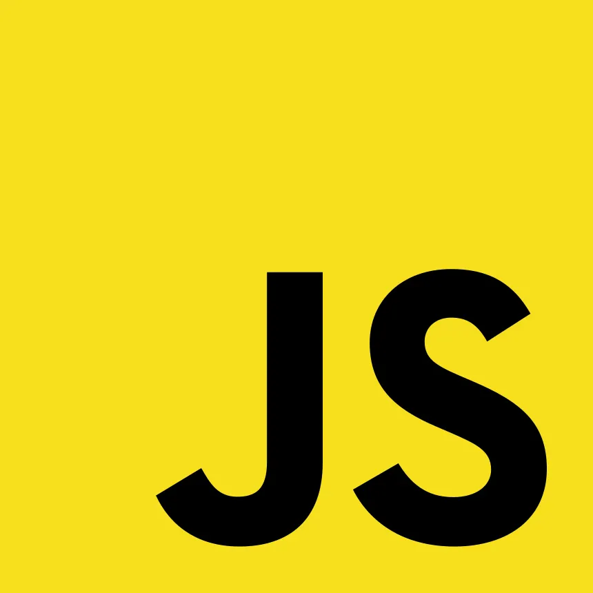
  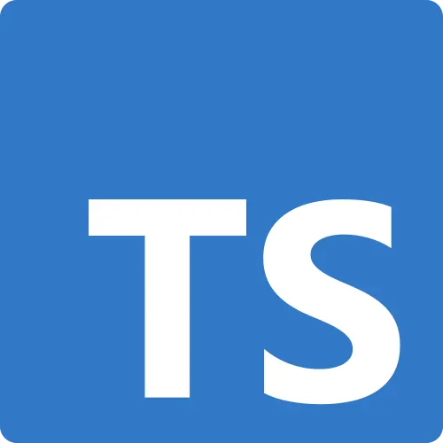
  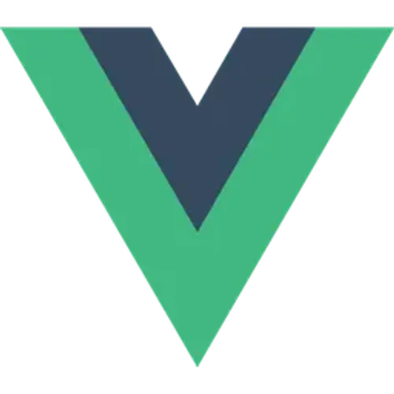
  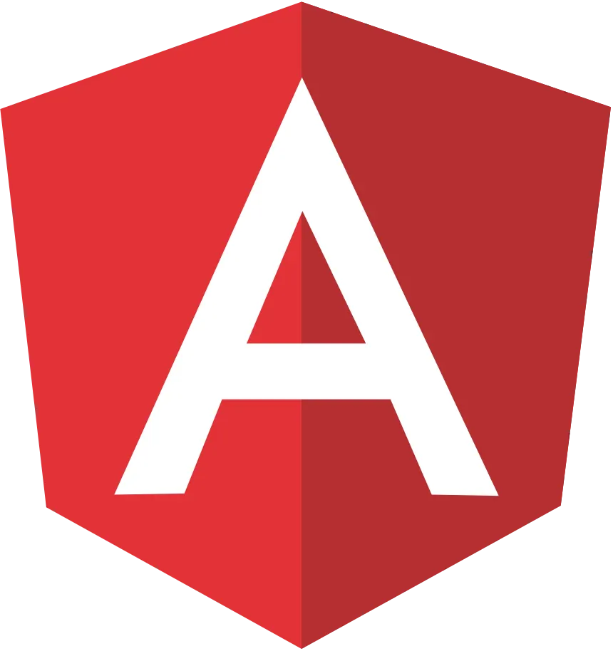
  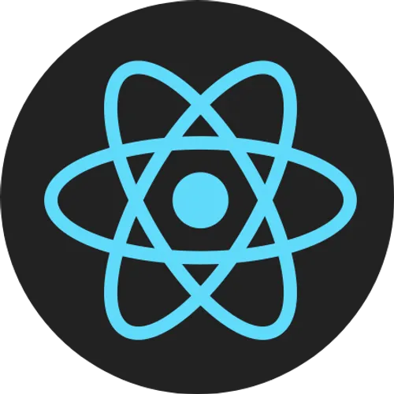
  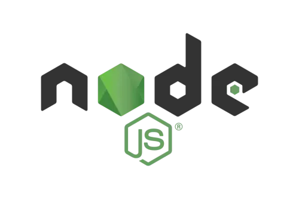
  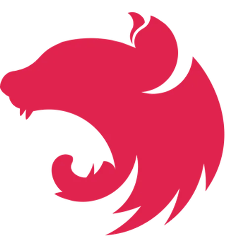
  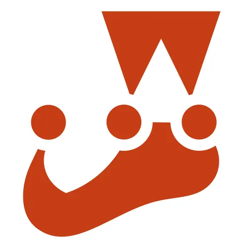
  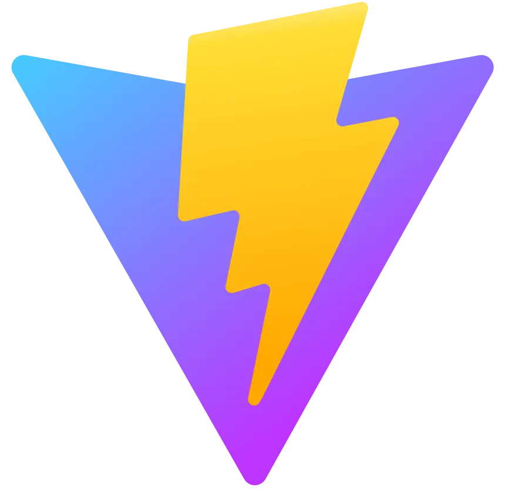
  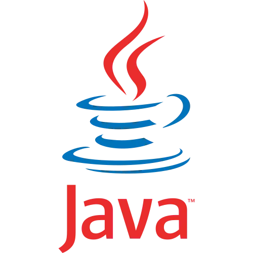
  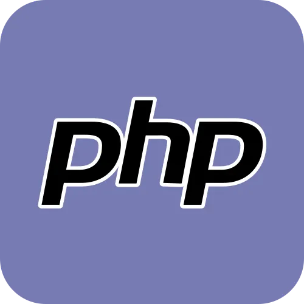
    
  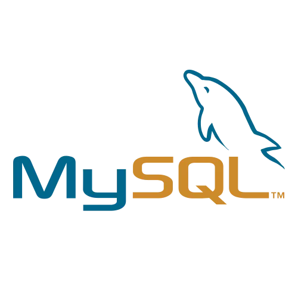
  
  
  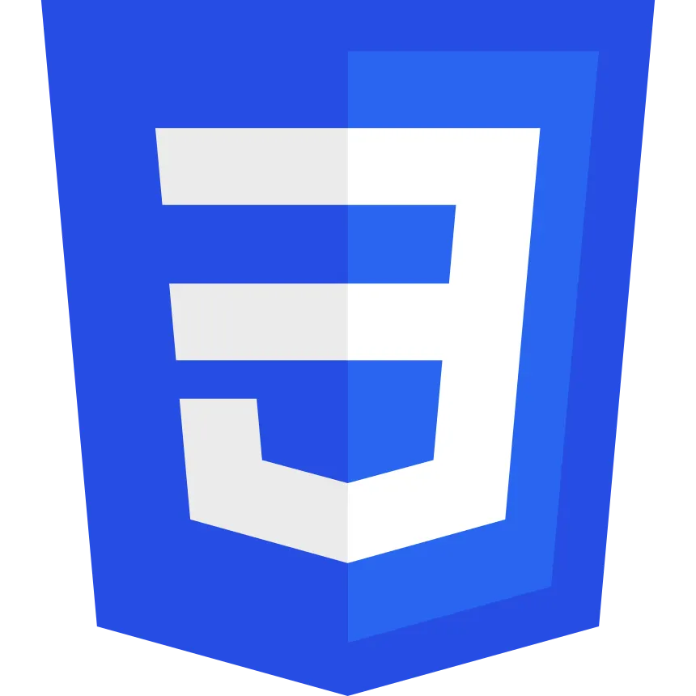
  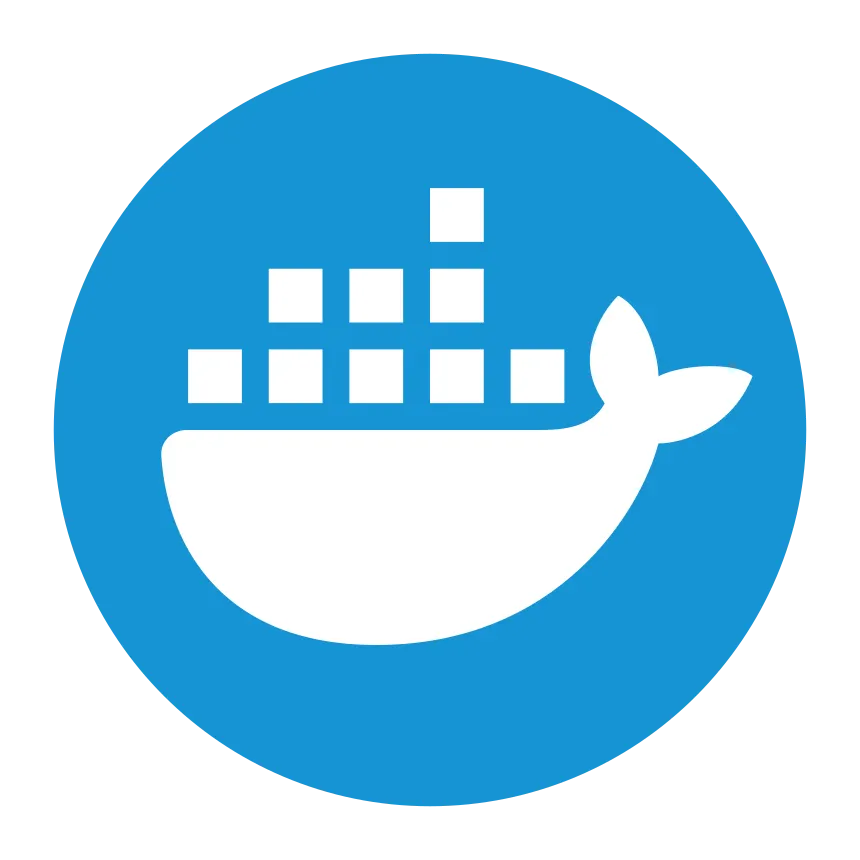
  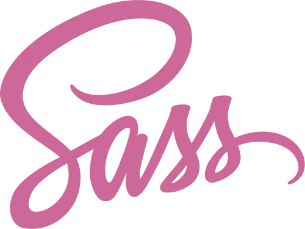
  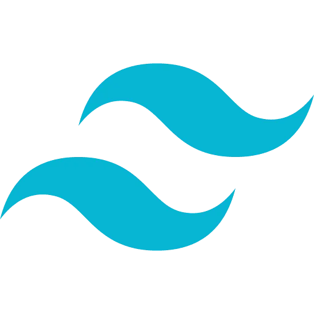
  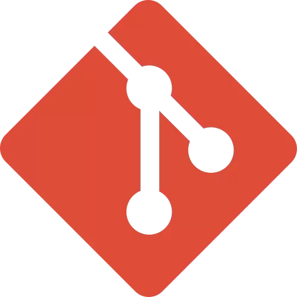
  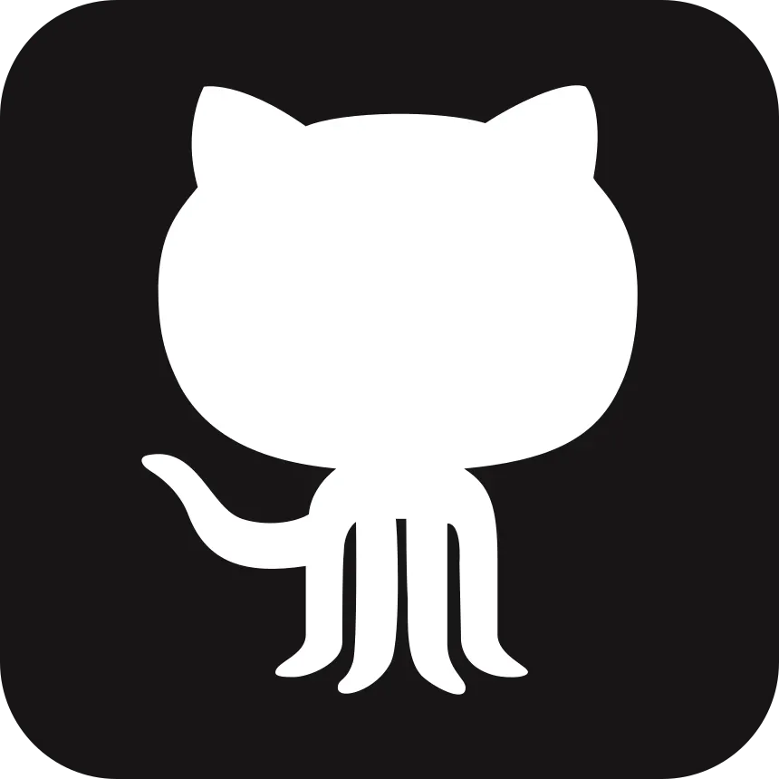
  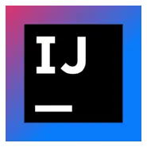

# Mis últimos proyectos

## leeer:

  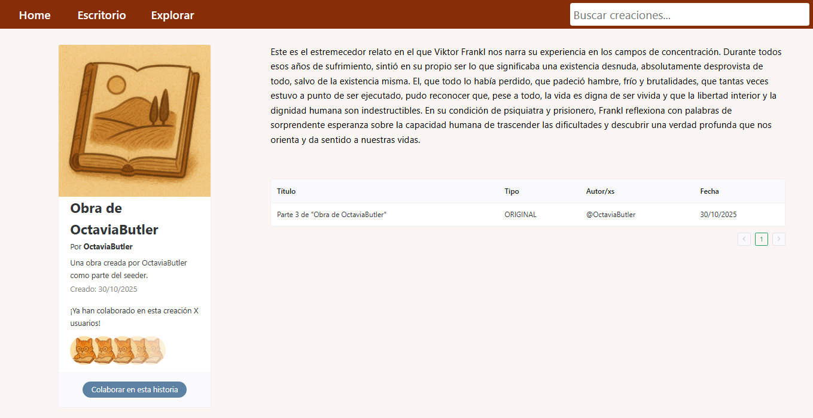

  

Una plataforma de escritura colaborativa. Sube tus historias originales o fanfictions de otras series, películas o videojuegos. Escribe de forma colaborativa con otros usuarios mediante invitación y experimenta con una imaginación ahora colectiva.

---

#### 🧠 TECNOLOGÍAS

  <!-- Core -->
  
  
  
  
  

  <!-- Languages & APIs -->
  
  

  <!-- Vue ecosystem -->
  
  
  

  <!-- Web basics -->
  
  

## leeer (API Rest):

  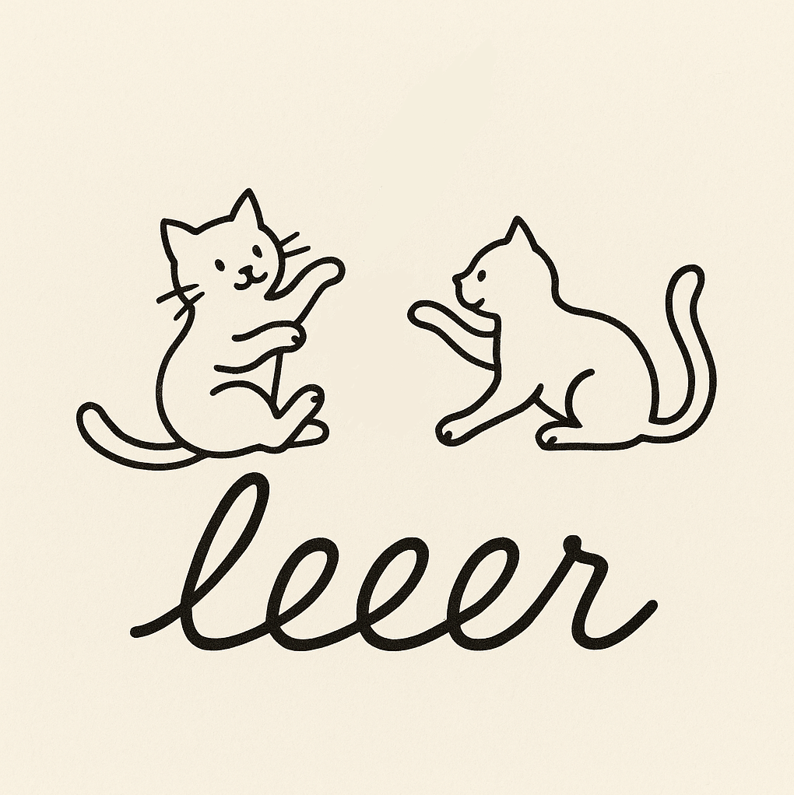

  

La columna vertebral en la que se sostiene leeer. Es una APIRestful construida en Nest.js con Typescript que separa claramente las responsabilidades de cada módulo.

Cuenta con documentación Swagger completa, autenticación por JWT Token, encriptación de contraseñas, TypeORM para MySQL, inicio rápido con Docker, rutas protegidas y mucho más.

---

#### 🧠 TECNOLOGÍAS

  <!-- Core & Frameworks -->
  
  
  
    <!-- Tools -->
  
  <!-- Backend & APIs -->
  
  
  
  <!-- Database & ORM -->
  
  
  <!-- Architecture & Design -->
  
  
  
  

# ¡Trabajemos juntos!

  
  

